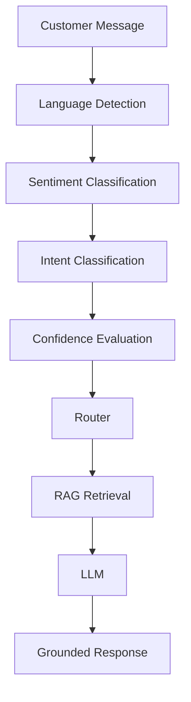

# RAG-Based E-commerce Customer Support Chatbot

## Overview
End-to-end RAG-based e-commerce customer support chatbot combining language
detection, sentiment/emotion classification, intent classification, and
grounded LLM response generation over a retrieval-augmented knowledge base.

## Architecture


## Status
🚧 Under active development — see commit history for progress by stage.

## Installation
```powershell
python -m venv .venv
.\.venv\Scripts\Activate.ps1
pip install -r requirements.txt
```

## GPU / CUDA Setup
This project uses CPU-only PyTorch by choice (kept install size small). See
`src/utils/device.py` for the device-selection logic — it automatically uses
CUDA if a GPU build of PyTorch is ever installed later, otherwise falls back
to CPU.

## Environment Variables
Copy `.env.example` to `.env` and fill in your Groq API key:
```text
GROQ_API_KEY=your_groq_api_key_here
```

*(Training, Knowledge Base, Running, Testing, Evaluation, Limitations, and
Future Improvements sections will be filled in as each stage is completed.)*

## License
TBD