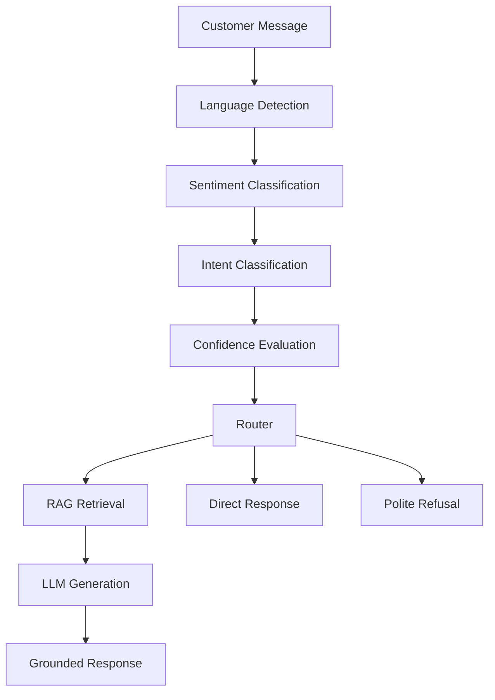

# RAG-Based E-commerce Customer Support Chatbot

## Overview

An end-to-end, retrieval-augmented customer support chatbot for e-commerce.
Every customer message is processed through four NLP stages — language
detection, sentiment analysis, intent classification, and semantic
retrieval — before a grounded response is generated by an LLM. The system
routes messages differently depending on what's detected: small talk gets
an instant canned reply, support questions retrieve relevant knowledge-base
context before generation, and complaints (or messages that look like
complaints even at low confidence, when paired with frustrated sentiment)
are flagged for human escalation alongside a helpful automated response.

## Architecture



**Routing logic:**
- `greeting` / `goodbye` / `gratitude` (rule-based, closed vocabulary) → instant direct response, no retrieval or LLM call
- `order_status` / `order_management` / `billing_and_refunds` / `account_management` → FAISS retrieval + Groq-generated grounded response
- `complaint` → retrieval + generation, **plus** flagged for human escalation, regardless of classifier confidence
- Low-confidence ML prediction **paired with Negative/Frustrated sentiment** → treated as an unclear complaint and escalated (a second, independent signal that this is a real, upset customer even when the specific intent is ambiguous)
- Low-confidence ML prediction with confidence below a noise floor, or with non-negative sentiment → polite refusal, asking the customer to rephrase or requesting human support

## Features

- **Language detection**: TF-IDF (character n-grams) + Logistic Regression across 20 languages, with training-data augmentation to handle short customer-message-length text
- **Sentiment analysis**: Fine-tuned DistilBERT classifying Negative/Frustrated, Neutral, Positive/Satisfied, with class-weighted training and domain-adapted augmentation for plain support questions
- **Intent classification**: TF-IDF + Logistic Regression on 6 routing-relevant intent categories, with a rule-based layer for greeting/goodbye/gratitude (zero training examples exist for these in the source dataset)
- **RAG pipeline**: sentence-transformer embeddings, FAISS vector store (24,274 indexed knowledge-base entries), Groq-hosted LLM generation grounded strictly in retrieved context
- **Confidence-aware, sentiment-aware routing**: multi-signal routing logic that avoids both false-confidence hallucination and cold, unhelpful refusals for genuinely upset customers
- **Two interfaces sharing one pipeline**: Streamlit (interactive chat with a full pipeline-details debug panel) and FastAPI (`POST /chat`) — zero duplicated NLP/RAG logic
- **Automated test suite**: 69 tests covering API endpoints, every model, and full routing paths, with the external Groq API mocked for fast, network-independent runs

## Project Structure

```text
RAG-Based-E-commerce-Customer-Support-Chatbot/
├── app/streamlit_app.py       # Chat UI
├── api/main.py                # FastAPI /chat endpoint
├── configs/config.py          # Central configuration
├── src/
│   ├── language_detection/    # TF-IDF + LogisticRegression
│   ├── sentiment/              # Fine-tuned DistilBERT
│   ├── intent/                 # TF-IDF + LogisticRegression + rules
│   ├── rag/                    # Embeddings, FAISS, retriever, generator
│   ├── chatbot/                # schemas, router, pipeline (orchestration)
│   └── utils/                  # device selection, logging
├── models/                     # Trained model artifacts (git-ignored)
├── vector_store/               # FAISS index (git-ignored)
├── tests/                      # 33 automated tests
└── reports/evaluation/         # Metrics, confusion matrices, classification reports
```

## Technologies

Python, PyTorch (CPU), Transformers, Sentence-Transformers, scikit-learn,
FAISS, Groq API, Streamlit, FastAPI, Uvicorn, Pytest.

## Datasets

- [`papluca/language-identification`](https://huggingface.co/datasets/papluca/language-identification) — 20-language identification, 90k samples
- [`dair-ai/emotion`](https://huggingface.co/datasets/dair-ai/emotion) — 6-emotion Twitter dataset, mapped to 3 sentiment buckets
- [`bitext/Bitext-customer-support-llm-chatbot-training-dataset`](https://huggingface.co/datasets/bitext/Bitext-customer-support-llm-chatbot-training-dataset) — 26,872 customer-support instruction/response pairs across 27 intents, used for both intent classifier training and the RAG knowledge base

## Installation

```powershell
python -m venv .venv
.\.venv\Scripts\Activate.ps1
pip install torch torchvision torchaudio --index-url https://download.pytorch.org/whl/cpu
pip install -r requirements.txt
```

## GPU / CUDA Setup

This project deliberately uses **CPU-only PyTorch** to keep the install
footprint small. `src/utils/device.py` centralizes device selection and
will automatically use CUDA if a GPU-enabled PyTorch build is installed
instead — no code changes needed elsewhere. All training and inference in
this project was done on CPU.

## Environment Variables

Copy `.env.example` to `.env` and add your Groq API key:

```text
GROQ_API_KEY=your_groq_api_key_here
```

Never commit `.env` — it's git-ignored. `.env.example` should only ever
contain the placeholder shown above.

## Training

Each module is trained independently:

```powershell
python -m src.language_detection.train
python -m src.sentiment.train
python -m src.intent.train
```

Sentiment fine-tuning (DistilBERT, CPU) takes roughly 2 hours; the other
two complete in a few minutes.

## Building the Knowledge Base

```powershell
python -m src.rag.build_vector_store
```

Builds sentence-transformer embeddings for the Bitext dataset and persists
a FAISS index to `vector_store/`.

## Running the Chatbot

**Streamlit:**
```powershell
streamlit run app\streamlit_app.py
```

**FastAPI:**
```powershell
python -m api.main
```
Then visit `http://localhost:8000/docs` for interactive API documentation,
or `POST` to `http://localhost:8000/chat` with `{"message": "..."}`.

## Testing

```powershell
pytest -v
```

69 tests covering API endpoints, language detection, sentiment, intent, retrieval,
and full pipeline routing (including edge cases for low-confidence, compound
greetings, and sentiment-aware escalation). The Groq API is mocked, so tests run
in seconds with no network dependency or API cost.

## Evaluation

| Module | Metric | Result |
|---|---|---|
| Language Detection | Test accuracy | 99.53% |
| Language Detection | Macro F1 | 0.9953 |
| Sentiment Classification | Test accuracy | 97.70% |
| Sentiment Classification | Macro F1 | 0.912 |
| Intent Classification | Test accuracy | 99.78% |
| Intent Classification | Macro F1 | 0.9974 |
| RAG Retrieval | Qualitative check | All 4 spec-suggested evaluation queries retrieved topically correct top-3 results (scores 0.69–0.99) |

Intent classification's 8 misclassifications (out of 3,642 test examples)
are concentrated at genuine category boundaries after condensing the
source dataset's 27 fine-grained intents into 6 routing categories — e.g.
`track_refund` confused with `order_status` (both involve tracking
language), and `change_shipping_address` confused with `out_of_scope`
(a category-boundary artifact of the condensation, not a model failure).

Full classification reports and confusion matrices for each module are in
`reports/evaluation/`.

## Limitations

Documented honestly, as this is not a production-ready system:

- **Language detection on short text**: character n-gram models rely on
  having enough characters for reliable signal. Short customer-style
  queries were a real weakness until training data was augmented with
  short-span snippets sampled from the original sentences; a residual
  weakness remains between Spanish and Portuguese specifically (the two
  most character-similar languages in the 20-language set), and between
  romanized Hindi/Urdu and Swahili (romanized non-Latin-script languages
  lose the strong script-based signal available to properly-scripted text).
- **Sentiment dataset domain mismatch**: `dair-ai/emotion` is Twitter text
  about personal emotional states, not customer-support language. The
  model initially misread plain transactional questions ("Where is my
  package?") as Negative/Frustrated; this was corrected via a small set of
  hand-written, naturally-phrased support examples added to the training
  split only. This improved real-world short-query calibration at a small
  cost to held-out Twitter-domain test-set macro F1 (0.913 → 0.890) — a
  deliberate trade-off favoring deployment-relevant performance over
  benchmark-set performance.
- **Sentiment negation handling (fixed)**: negated positive statements
  (e.g. "this is *not* acceptable") were initially misclassified as
  Positive/Satisfied with high confidence, likely because the training
  data contains few negated-evaluative-statement examples. Fixed by adding
  hand-written negated-positive *and* negated-negative examples to the
  training split — the latter specifically to avoid overcorrecting into
  "negation always means negative." Verified via manual test cases;
  confidence on the original failing example rose from misclassifying at
  high confidence to correctly classifying at 99.98% confidence, with no
  regression on negated-negative or earlier domain-shift test cases.
  - **Non-English input to English-only stages**: language detection is
  genuinely multilingual (20 languages), but sentiment and intent
  classification are trained only on English data (`dair-ai/emotion` and
  the Bitext dataset). On non-English input, these two stages produce
  unreliable results — e.g. a neutral Chinese question ("我的订单在哪里?")
  was misclassified as 96%-confidence Negative/Frustrated. The system
  degrades safely rather than acting on this bad signal: low intent
  confidence on non-English text typically falls below the noise floor
  and correctly routes to a polite refusal rather than a false escalation
  or a hallucinated response — verified via manual testing across Chinese,
  Spanish, French, and other non-English queries.
- **Emotion-to-sentiment mapping**: `surprise` is mapped to Neutral as an
- **Emotion-to-sentiment mapping**: `surprise` is mapped to Neutral as an
  approximation — surprise can be genuinely positive or negative depending
  on context, and the dataset doesn't disambiguate this.
- **Knowledge base coverage**: the RAG system can only answer questions
  covered by the Bitext dataset's 27 intents; anything outside that scope
  correctly triggers an honest "I don't have this information" response
  rather than a hallucinated answer, but coverage is inherently limited to
  what's in the knowledge base.
- **No real order/account database integration**: the system cannot look
  up actual order status, account details, or process real refunds — it
  guides customers on process and escalates to human agents rather than
  performing real transactions.
- **LLM dependency**: response generation depends on the Groq API being
  available; a network or API failure falls back to a generic "try again
  shortly" message rather than any generated response.
- **Confidence-threshold routing is a heuristic, not a guarantee**: the
  sentiment-aware escalation fallback (Stage 7/10) improves handling of
  ambiguous-but-frustrated messages, but is tuned on a small number of
  manually observed cases rather than a systematically validated threshold.

## Future Improvements

- Negation-aware and broader adversarial-example augmentation for sentiment
- Expand the RAG knowledge base beyond the Bitext dataset's 27 intents
- Real order/account system integration for genuine transactional actions
- Systematic threshold tuning for